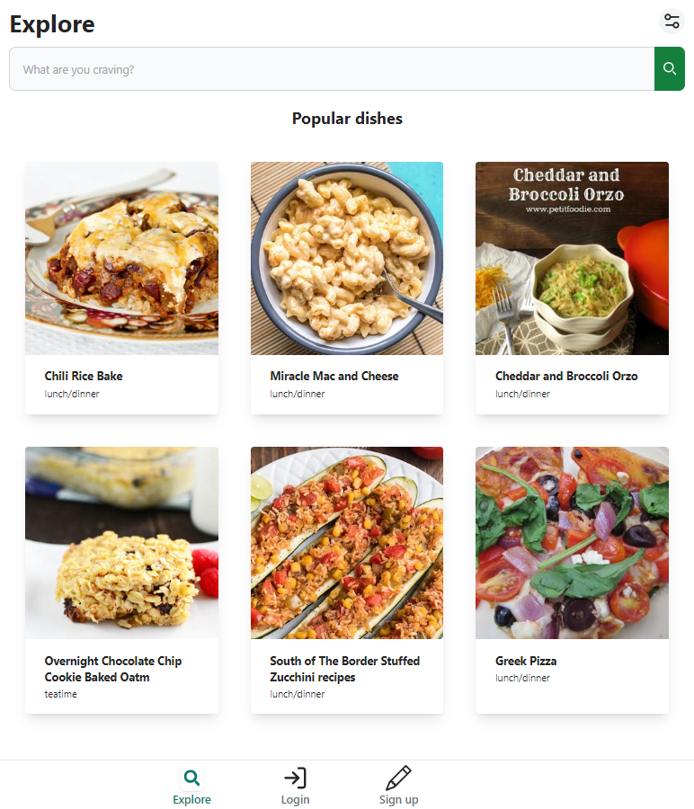
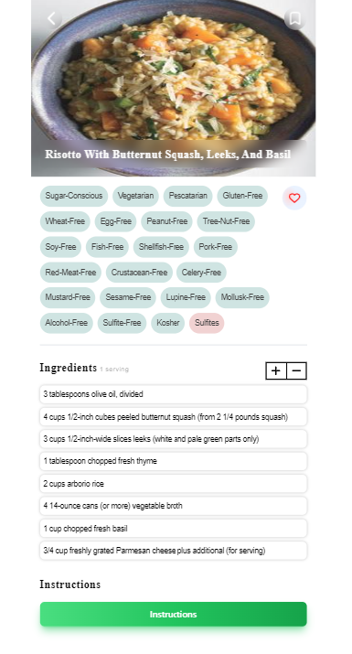
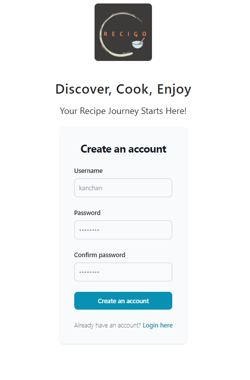

# Recigo 🍳
Live demo: [Recigo](https://recipo-frontend.onrender.com)
<div style="display: flex; justify-content: space-between;">
  
  
  
</div>

 **Recigo** is your ultimate culinary companion for finding delicious recipes tailored to your preferences. With a wide range of filters, including meal type, health restrictions, diet options, and dish types, **Recigo** makes it effortless to discover the perfect recipe for any occasion."

# Features
- Responsive website
- User Login/Signup
- Various filters for searching recipes 

# Built with
- Database: ElephantSQL
- Backend: Node.js, Express.js, pg(node-postgres)
- frontend: Vite, React, Tailwind
- API : [EDAMAM Recipe API](https://developer.edamam.com/edamam-recipe-api).

# Contributors
- Developers: [MS07062000](https://github.com/MS07062000), [Tomomi-K1](https://github.com/Tomomi-K1), [mhatrekanchan01](https://github.com/mhatrekanchan01), [limyod](https://github.com/limyod)
- UX/UI designer: Yeji

# Setup
#### Starting backend
1. Navigate to server folder
   ```bash
   $cd server
   ```
2. Create `.env` file and include following information. 
   You can create your own `JWT_SECRET_KEY`. 
   Please create your own `EDAMAM_APP_ID`and `EDAMAM_APP_KEY` at [edamam.com/](https://www.edamam.com/)
   ```bash
   EDAMAM_APP_ID=XXXX
   EDAMAM_APP_KEY=XXXXX
   JWT_SECRET_KEY=XXXXX
   DATABASE=postgres://XXXXXX
   ```
3.  Start backend server.
    ```bash
    $nodemon app.js
    ```
4. server will start up on `[localhost:3000](http://localhost:3000)`

#### Starting frontend
1. Navigate to frontend folder
   ```bash
   $cd client
   ```
2. Create `.env` file and include following information. 
   `VITE_JWT_SECRET_KEY` should be the same as `JWT_SECRET_KEY` on the server side `.env`. 
   ```bash
   VITE_ENVIRONMENT=development
   VITE_JWT_SECRET_KEY=XXXXXXX
   ```
3. Run vite with below command and open [http://localhost:5173/](http://localhost:5173/) to view it in your browser.
   ```bash
   $npm run dev
   ```


